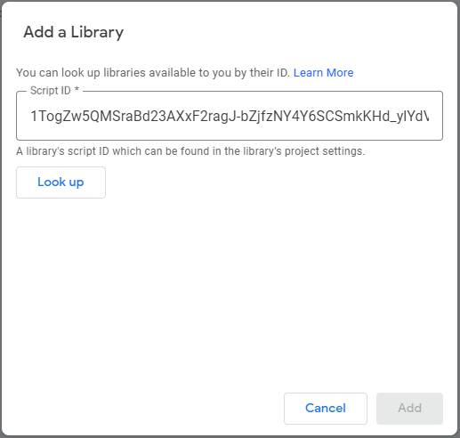

[](https://github.com/google/clasp)
[](LICENSE)

# MenuApp

MenuApp is a small library for building custom menus from JSON configuration.

```javascript
const menu = MenuApp.buildMenu({
    type  : MenuApp.DocTypes.DOCUMENT,
    title : "My Menu",
    items : [{
        title : "My Action",
        action : "runMyAction"
    },{
        title : "Submenu",
        items : [{
            title : "My Second Action",
            actions : "MyLib.doSomething"
        }]
    }],
    append : true
});
```

# Install

> Latest library version: 17

If developing locally, add the project info to manifest file's `dependencies.libraries` list:

| Field             | Required | Value                                                                    |
| ----------------- | -------- | ------------------------------------------------------------------------ |
| `libraryId`       | yes      | `1wr0xwr-RgfP0j9acfpJy2ESd3q4oqgM2bt0mgOemhRGS-U2N1XDxRuYk`              |
| `version`         | yes      | Library version you want to use                                          |
| `userSymbol`      | no       | The library name, `MenuApp` by default                                   |
| `developmentMode` | no       | Include the library in dev mode (will use any latest _unstable_ version) |

Sample JSON object to add:

```json
{
    "libraryId": "1wr0xwr-RgfP0j9acfpJy2ESd3q4oqgM2bt0mgOemhRGS-U2N1XDxRuYk",
    "userSymbol": "MenuApp",
    "version": "17",
    "developmentMode": false
}
```

Otherwise, use the new online editor UI to add the library (the id is the same as in `libraryId`):


